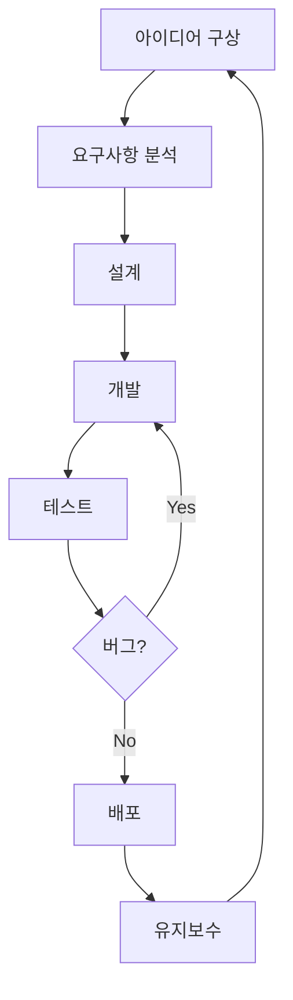

<h1 align="center">안녕하세요, 저는 [당신의 이름]입니다! 👋</h1>

<p align="center">
  <a href="https://your-website.com"></a>
  <a href="https://linkedin.com/in/luxcoa"></a>
  <a href="https://twitter.com/luxcoa"></a>
  <a href="https://www.youtube.com/channel/your-channel"></a>
</p>

<p align="center">
  
</p>


### 🚀 저에 대해 자세히 알아보세요:

- 🔭 현재 [현재 프로젝트]에 대해 작업 중입니다
- 🌱 [배우고 있는 기술]을 학습하고 있어요
- 👯 [협업하고 싶은 분야]에서 협업을 찾고 있습니다
- 💬 [전문 분야]에 대해 질문해주세요
- 📫 연락 방법: your.email@example.com
- 😄 대명사: [당신의 대명사]
- ⚡ 재미있는 사실: [당신에 대한 재미있는 사실]
- 🎵 좋아하는 음악: [좋아하는 음악 장르나 아티스트]
- 📚 현재 읽고 있는 책: [책 제목]

<h3 align="left">언어 및 도구:</h3>
<p align="left">
<a href="https://www.python.org" target="_blank">  </a>
<a href="https://developer.mozilla.org/en-US/docs/Web/JavaScript" target="_blank">  </a>
<a href="https://www.typescriptlang.org/" target="_blank">  </a>
<a href="https://reactjs.org/" target="_blank">  </a>
<a href="https://nodejs.org" target="_blank">  </a>
<a href="https://www.docker.com/" target="_blank">  </a>
<!-- 더 많은 기술 아이콘 추가 -->
</p>

---

### 🏆 주요 프로젝트 및 기여:

<details>
  <summary>프로젝트 1: AI 기반 이미지 분석 도구</summary>
  
  [](https://github.com/luxcoa/ai-image-analyzer)
  
  - 💡 주요 기능: 이미지 객체 인식, 색상 분석, 스타일 추천
  - 🛠️ 사용 기술: Python, TensorFlow, Flask, React
  - 🌟 주요 성과: 1000+ GitHub 스타, 일일 활성 사용자 500명 이상
  - [라이브 데모](https://ai-image-analyzer.com) | [상세 문서](https://github.com/luxcoa/ai-image-analyzer/wiki)
</details>

<details>
  <summary>프로젝트 2: 블록체인 기반 투표 시스템</summary>
  
  [](https://github.com/luxcoa/blockchain-voting)
  
  - 💡 주요 기능: 안전한 전자 투표, 실시간 결과 집계, 투명성 보장
  - 🛠️ 사용 기술: Solidity, Web3.js, React, Node.js
  - 🌟 주요 성과: 3개의 지역 선거에서 실제 사용, 보안 감사 통과
  - [기술 백서](https://blockchain-voting.com/whitepaper) | [개발자 API](https://docs.blockchain-voting.com)
</details>

<details>
  <summary>오픈 소스 기여</summary>
  
  - [TensorFlow](https://github.com/tensorflow/tensorflow/pulls?q=author%3Aluxcoa): 2개의 성능 개선 PR 병합
  - [React](https://github.com/facebook/react/pulls?q=author%3Aluxcoa): 문서화 개선 및 버그 수정
  - [VS Code](https://github.com/microsoft/vscode/pulls?q=author%3Aluxcoa): 새로운 테마 기여
</details>

---

### 📊 GitHub 통계:

<p align="center">
  
  
</p>

---

### 🌱 최근 학습 및 개발 활동:

<!--START_SECTION:waka-->
```text
Python       15 hrs 41 mins  ████████████▓░░░░░░░░░░░░   50.67 % 
JavaScript   9 hrs 32 mins   ███████▓░░░░░░░░░░░░░░░░░   30.83 % 
TypeScript   2 hrs 50 mins   ██▒░░░░░░░░░░░░░░░░░░░░░░   09.17 % 
HTML         1 hr 10 mins    █░░░░░░░░░░░░░░░░░░░░░░░░   03.82 % 
Markdown     52 mins         ▓░░░░░░░░░░░░░░░░░░░░░░░░   02.83 % 
```
<!--END_SECTION:waka-->

---

### 📚 최근 블로그 포스트:
<!-- BLOG-POST-LIST:START -->
- [AI와 윤리: 개발자의 책임](https://yourblog.com/ai-ethics)
- [블록체인 기술의 미래: 2025년 전망](https://yourblog.com/blockchain-future)
- [클린 코드 작성법: 초보자를 위한 가이드](https://yourblog.com/clean-code-guide)
<!-- BLOG-POST-LIST:END -->

---

### 🎓 자격증 및 교육:

- [딥러닝 전문가 과정](https://www.coursera.org/account/accomplishments/specialization/ABCDE12345) - Coursera
- [AWS 공인 솔루션스 아키텍트](https://www.youracclaim.com/badges/12345678-abcd-efgh-ijkl-1234567890ab) - Amazon Web Services
- [Certified Kubernetes Administrator](https://www.cncf.io/certification/cka/) - Cloud Native Computing Foundation

---

### 💼 워크플로우:



---

### 🎵 현재 들으며 코딩 중인 노래:

[](https://github.com/kittinan/spotify-github-profile)

---

### 📫 연락하기:

<p align="center">
  <a href="mailto:your.email@example.com"></a>
  <a href="https://calendly.com/luxcoa"></a>
</p>

---

### 🤝 방문자 참여:

<details>
<summary>🧩 이번 주 코딩 챌린지</summary>
<br>
주어진 정수 배열에서 가장 긴 연속된 증가 부분 수열의 길이를 찾는 함수를 작성해보세요!

```python
def longest_increasing_subarray(arr):
    # 여기에 코드를 작성하세요
    pass

# 테스트 케이스
print(longest_increasing_subarray([1, 3, 5, 4, 7]))  # 예상 출력: 3
print(longest_increasing_subarray([2, 2, 2, 2, 2]))  # 예상 출력: 1
```

해답은 다음 주에 공개됩니다. 행운을 빕니다!
</details>

<details>
<summary>✍️ 방명록 남기기</summary>
<br>
<a href="https://github.com/luxcoa/luxcoa/issues/new?template=visitor-message.md&title=방명록%20메시지"></a>

방문자들의 메시지:
<!-- GUESTBOOK:START -->
<!-- GUESTBOOK:END -->
</details>

---

<p align="center">
  
</p>

<div align="center">

</div>

---

⭐️ From [luxcoa](https://github.com/luxcoa)
